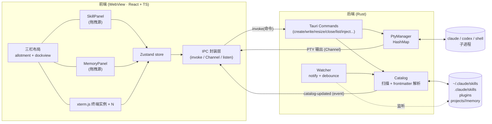

# 01 · 产品与架构

## 1. 产品目标

把"多终端 + Claude Skill 浏览 + Claude Memory 浏览 + 拖拽注入"整合进一个轻量桌面应用，让用户在指挥 Claude Code / Codex 时，**无需记忆和手敲** skill/memory 的调用方式。

### 用户故事

- 作为用户，我能在一个窗口里**同时开多个终端**（标签页 + 左右分屏），分别跑不同项目的 Claude Code / Codex。
- 作为用户，我能在左栏**搜索并浏览**当前可用的 skill，在右栏浏览当前项目的 memory。
- 作为用户，我把某个 skill **拖到**终端 1，终端 1 里运行的 Claude 就立刻收到 `/skill-name`；拖一个 memory，就收到 `@该文件绝对路径`。
- 作为用户，skill/memory 文件在磁盘上被新增/修改/删除时，列表**自动刷新**，无需重启。

---

## 2. 核心功能清单（v1 范围）

| 模块 | 功能 |
|---|---|
| **终端区** | 多终端；标签页；左右/上下分屏；拖动重排；每终端可选 Profile（Claude / Codex / PowerShell / Bash）；复制粘贴、滚动回看、清屏、字体缩放、终端内搜索 |
| **Skill 栏** | 扫描 user / project / plugin 三类来源；卡片显示 `name` + `description` + 来源徽标；顶部搜索框模糊过滤；作为拖拽源 |
| **Memory 栏** | 扫描"当前项目"的 memory 目录；卡片显示 `name` + `description` + 类型（user/feedback/project/reference）徽标；作为拖拽源；可切换当前项目 |
| **拖拽注入** | 卡片 → 终端面板的 HTML5 拖放；按目标终端 Profile 生成注入文本；写入该终端 PTY；可选自动回车 |
| **实时刷新** | 文件系统监听，skill/memory 目录变更自动更新列表 |
| **配置持久化** | 窗口布局、终端 Profile、扫描根目录、注入模板、当前项目等本地持久化 |

**明确不在 v1**：远程/SSH 终端、云同步、skill/memory 的编辑器（只读浏览 + 拖拽）、多窗口。详见 [05](./05-里程碑与任务拆解.md)。

---

## 3. 技术栈总览

| 层 | 选型 | 说明 |
|---|---|---|
| 桌面框架 | **Tauri 2.x** | Rust 后端 + 系统 WebView 前端，包体小、内存省 |
| 后端语言 | **Rust** (stable) | PTY、文件扫描、监听、命令处理 |
| PTY | **`portable-pty`**（wezterm） | 跨平台伪终端；Windows 自动走 ConPTY |
| 文件监听 | **`notify`** + `notify-debouncer-full` | 监听 skill/memory 目录 |
| 前端框架 | **React 18 + TypeScript + Vite** | Tauri 官方模板支持 |
| 终端渲染 | **xterm.js**（`@xterm/xterm` + addons） | `fit` / `webgl` / `search` / `web-links` |
| 停靠布局 | **`dockview`** | 标签页 + 分屏 + 拖动重排，TS 原生 |
| 外层三栏 | **`allotment`** | 可拖拽调宽的左/中/右分栏 |
| 状态管理 | **`zustand`** | 轻量，无样板 |
| 模糊搜索 | **`fuse.js`** | skill/memory 搜索过滤 |
| 样式 | **Tailwind CSS** | 快速出 UI；或 CSS Modules（团队偏好二选一） |
| 配置存储 | **`tauri-plugin-store`** | JSON 形式持久化设置 |

---

## 4. 整体架构



### 关键数据流

1. **终端输出（高频）**：子进程 stdout → PTY → Rust reader 线程 → `tauri::ipc::Channel<Vec<u8>>` 流式推到前端 → `xterm.write()`。
   > 用 **Channel** 而非全局 event，避免高频输出时的序列化/广播开销。
2. **终端输入**：xterm `onData` → `invoke("write_terminal", {id, data})` → `PtySession.write()` → 子进程 stdin。
3. **尺寸变更**：xterm `FitAddon` 算出 cols/rows → `invoke("resize_terminal", {id, cols, rows})` → PTY resize。
4. **目录加载**：前端启动时 `invoke("list_skills")` / `invoke("list_memories", {project})` → Rust 扫描+解析 → 返回结构化列表。
5. **实时刷新**：`notify` 监听目录 → 防抖 → 重扫受影响目录 → emit `catalog-updated` → 前端重新拉取并 diff 更新列表。
6. **拖拽注入**：卡片 drop 到终端面板 → 前端拿到 `目标终端 id` + `被拖项` → `invoke("inject_item", {term_id, item, submit})` → Rust 按该终端 Profile 选模板生成文本 → 写入 PTY（可选追加 `\r`）。

---

## 5. 顶层窗口布局

```
HtyBox 窗口
└─ <Allotment>  (水平三栏, 可拖拽调宽, 宽度持久化)
   ├─ 左栏  SkillPanel        默认 240px, 可折叠
   │    ├─ 搜索框 (fuse.js 过滤)
   │    └─ Skill 卡片列表 (draggable)
   ├─ 中栏  TerminalDock       flex 自适应
   │    └─ <DockviewReact>     标签页 + 分屏
   │         ├─ panel: 终端1  → <TerminalView termId=...>
   │         ├─ panel: 终端2  → <TerminalView termId=...>
   │         └─ "+" 新建终端 (选择 Profile)
   └─ 右栏  MemoryPanel        默认 240px, 可折叠
        ├─ 项目选择器 (决定 memory 作用域)
        └─ Memory 卡片列表 (draggable)
```

- 左右栏宽度、是否折叠、dockview 的标签/分屏结构都写入配置持久化，下次启动恢复。
- **拖拽落点**：dockview 每个终端面板是一个独立 drop target；落到哪个面板就注入哪个终端。分屏时需精确命中目标 pane（实现见 [05](./05-里程碑与任务拆解.md) 拖放高亮覆盖层）。

---

## 6. 仓库目录结构

```
HtyBox/
├─ Document/                  # 本设计文档目录
├─ src/                       # 前端 (React + TS)
│  ├─ main.tsx
│  ├─ App.tsx                 # 三栏 Allotment 装配
│  ├─ components/
│  │  ├─ skill/SkillPanel.tsx
│  │  ├─ skill/SkillCard.tsx
│  │  ├─ memory/MemoryPanel.tsx
│  │  ├─ memory/MemoryCard.tsx
│  │  ├─ terminal/TerminalDock.tsx     # dockview 容器
│  │  ├─ terminal/TerminalView.tsx     # 单个 xterm 实例
│  │  └─ common/SearchBox.tsx
│  ├─ store/                  # zustand: terminals / catalog / settings
│  ├─ ipc/                    # invoke 封装 + Channel 订阅 + event 监听
│  ├─ hooks/                  # useTerminal / useCatalog / useDragInject
│  ├─ types/                  # 与 Rust 对齐的 TS 类型
│  └─ styles/
├─ src-tauri/                 # 后端 (Rust)
│  ├─ src/
│  │  ├─ main.rs              # Tauri builder + 注册命令/状态
│  │  ├─ state.rs             # AppState (PtyManager, Catalog 缓存, 配置)
│  │  ├─ pty/                 # mod: PtyManager, PtySession, reader 线程
│  │  ├─ catalog/             # mod: 扫描、frontmatter 解析、模型
│  │  ├─ watcher.rs           # notify 监听 + 防抖 + emit
│  │  ├─ inject.rs            # 注入模板矩阵
│  │  └─ commands.rs          # 所有 #[tauri::command]
│  ├─ Cargo.toml
│  ├─ tauri.conf.json
│  └─ capabilities/           # Tauri 2 权限能力配置
├─ package.json
├─ vite.config.ts
└─ tsconfig.json
```

> 各模块的接口细节见 [02 后端](./02-后端Rust设计.md) 与 [03 前端](./03-前端React设计.md)。
