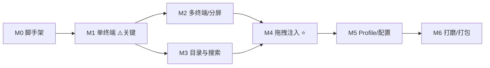
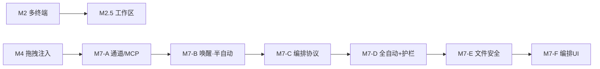

# 05 · 里程碑与任务拆解

按"先打通最难的 PTY，再逐层叠加"的原则推进。每个里程碑都是一个**可运行、可验收**的状态。

**关键路径**：M1（单终端 PTY 跑通）是全局风险最高的一环——Tauri + portable-pty + xterm 在 Windows/ConPTY 下能否稳定双向通信，决定整个方案成立与否。**务必在 M1 尽早验证**，再投入其余功能。

---

## M0 · 脚手架（地基）

**目标**：Tauri 2 + React + TS + Vite 工程能 `pnpm tauri dev` 起窗口，三栏骨架就位。

- [ ] `pnpm create tauri-app@latest`（React + TypeScript + Vite）
- [ ] 接入 Tailwind、ESLint/Prettier
- [ ] 装 `allotment`，搭出左/中/右三栏空壳（占位文字）
- [ ] 三栏可拖拽调宽
- [ ] 配 `src/`、`src-tauri/src/` 目录结构（见 [01 §6](./01-产品与架构.md)）
- [ ] 接入 `tauri-plugin-store`，跑通一次 `get_config`/`set_config` 空实现

**验收**：窗口打开，三栏可拖动调宽，热重载正常。

---

## M1 · 单终端 MVP（关键路径）⚠️

**目标**：中栏渲染**一个**真实终端，能输入能输出，能 resize。

- [ ] Rust：引入 `portable-pty`，实现 `PtyManager.spawn/write/resize/close`
- [ ] Rust：reader 线程用 `tauri::ipc::Channel<Vec<u8>>` 流式推输出
- [ ] Rust：注册 `create_terminal/write_terminal/resize_terminal/close_terminal` 命令
- [ ] 前端：`TerminalView` 集成 xterm + FitAddon + WebglAddon
- [ ] 前端：Channel 收输出 → `term.write`；`onData` → `write_terminal`
- [ ] 前端：`ResizeObserver` + Fit → `resize_terminal`
- [ ] 启动 `powershell.exe`，验证可交互（`dir`、中文、回退键、Ctrl+C）
- [ ] 验证 `launch_cmd` 自动发送 `claude\r` 能起 Claude Code 且 TUI 正常渲染
- [ ] 组件卸载 → `close_terminal` 杀进程，无僵尸进程

**验收**：能在内嵌终端里正常使用 PowerShell 和 Claude Code；缩放窗口排版不乱；关闭面板进程退出。
**风险点**：ConPTY 行为、claude TUI 的 ANSI 重绘、UTF-8 解码、resize 时序。早测早改。

---

## M2 · 多终端：标签页 + 分屏

**目标**：用 dockview 支持多终端、标签页、左右/上下分屏、拖动重排。

- [ ] 装 `dockview`，`TerminalDock` 用 `DockviewReact` 承载 `terminal` panel
- [ ] 每 panel 绑定独立 `termId` + Profile，挂一个 `TerminalView`
- [ ] "+" 新建终端（先固定 PowerShell，Profile 选择留到 M5）
- [ ] 关闭标签 → 卸载 → `close_terminal`
- [ ] 分屏（右/下）与标签拖动重排可用
- [ ] 焦点跟踪：记录"当前聚焦终端 id"
- [ ] dockview 布局 `toJSON/fromJSON` 持久化与恢复
- [ ] 多终端并发输出互不串扰（每个独立 Channel + 独立会话）

**验收**：能同时开 ≥3 个终端，自由分屏/标签化，关掉应用再开能恢复布局结构。

---

## M3 · Skill / Memory 目录与搜索

**目标**：左右栏列出真实的 skill/memory，可搜索，文件变更自动刷新。

- [ ] Rust：frontmatter 解析器（`---` 切分 + `serde_yaml`）
- [ ] Rust：`catalog::skill` 扫 user/project/plugin 三类来源，推导 `invoke`
- [ ] Rust：`catalog::memory` 实现 slug 算法 + 扫描，校验本机现存目录
- [ ] Rust：`list_skills` / `list_memories` / `list_projects` 命令
- [ ] Rust：`watcher` 用 `notify` + 防抖监听，emit `catalog-updated`
- [ ] 前端：`SkillPanel`/`MemoryPanel` 卡片列表 + 来源/类型徽标
- [ ] 前端：`SearchBox` + `fuse.js` 模糊过滤
- [ ] 前端：`ProjectSelector` 切换 memory 作用域（默认启动目录）
- [ ] 前端：监听 `catalog-updated` → 局部刷新

**验收**：左栏看到插件市场里的 skill，右栏看到 `G--hty-workflows`（初期可能为空，换到 `d--igpworks-arena` 应看到 7 条 memory）；新增/改/删文件后列表自动更新；搜索可用。

---

## M4 · 拖拽注入（核心功能）⭐

**目标**：把卡片拖到终端，按 Profile 注入正确引用。

- [ ] 前端：`SkillCard`/`MemoryCard` 设为 draggable，`dataTransfer` 带结构化数据
- [ ] 前端：`TerminalView` 注册 drop target，拖入高亮、精确命中分屏 pane
- [ ] Rust：`inject.rs` 实现注入模板矩阵（见 [04 §4](./04-数据模型与注入.md)）
- [ ] Rust：`inject_item` 命令 → `build_text` → 写 PTY，`submit` 控制是否追加 `\r`
- [ ] 前端：Shift+落下 = 自动发送；否则只填充不回车
- [ ] **真机校验**注入语法：在 Claude Code 里 `/skill` 和 `@path` 确实生效；在 Codex 里 `@path` 生效；据此定稿默认模板
- [ ] 注入失败的错误反馈（toast）

**验收**：把一个 skill 拖到跑着 Claude Code 的终端，Claude 收到 `/skill-name` 并能识别；拖一个 memory 收到 `@绝对路径` 且能被读取；拖到不同分屏命中正确终端。

---

## M5 · Profile 与配置

**目标**：终端类型化（Claude/Codex/Shell），配置可持久化与编辑。

- [ ] 内置 Profile（Claude/Codex/PowerShell/Bash），新建终端时可选
- [ ] Profile 的 `cwd`/`env`/`launchCmd`/`agentKind` 生效
- [ ] 注入模板按 `agentKind` 正确切换（claude 用 `/`，codex 用 `@`）
- [ ] 设置面板：编辑扫描根目录、注入模板、自动回车默认值
- [ ] 配置全量持久化（布局 + Profile + 模板 + 当前项目）并在启动恢复
- [ ] memory `memoryBase` 可手动覆盖（slug 兜底）

**验收**：能新建一个 Codex 终端，拖 skill 注入的是 `@路径` 而非 `/命令`；改完设置重启生效。

---

## M6 · 打磨与打包

**目标**：体验完善，产出可分发安装包。

- [ ] 终端：终端内搜索（SearchAddon）、复制粘贴、清屏、字体缩放、链接可点（web-links）
- [ ] 交互：聚焦终端边框高亮、空状态/加载态、错误 toast
- [ ] 卡片：悬停/点击预览 frontmatter 与正文摘要（`read_item_body`）
- [ ] 主题：深色为主，可跟随系统
- [ ] 快捷键：新建/关闭终端、切分屏、聚焦搜索
- [ ] 健壮性：子进程异常退出提示、坏文件跳过、watcher 异常自恢复
- [ ] 打包：`pnpm tauri build` 出 NSIS/MSI 安装包（见 [06](./06-风险测试与打包.md)）
- [ ] 图标、应用名、版本号、自动更新（可选）

**验收**：安装包可在干净 Win10/11 装好即用；核心流程（开终端 → 起 claude → 拖 skill/memory）顺畅无明显卡顿。

---

## 里程碑依赖与排期

- M3 可与 M2 **并行**（都只依赖 M0/M1）。
- 粗略投入（单人，熟悉 React、初学 Rust/Tauri）：M0≈0.5d，M1≈2–3d（含踩 ConPTY 坑），M2≈1.5d，M3≈2d，M4≈1.5d，M5≈1d，M6≈2d。合计约 **2 周**。Rust/Tauri 越熟越快。

> 进度建议：M1 一旦跑通即可写一条 memory 记录"ConPTY + portable-pty + xterm 的可用组合与坑"，避免后续重复踩。

---

## 扩展里程碑（功能增量，详见专文）

主线 M0–M6 之外，两项能力有独立设计与里程碑：

- **M2.5 · 工作区管理** —— 见 [07-工作区管理.md](./07-工作区管理.md)。可与 M2/M3 并行，主要是状态分层与持久化。
- **M7 · 多 Agent 协作** —— 见 [08-多Agent协作设计.md](./08-多Agent协作设计.md)。建议在 M4 之后展开，按"自主程度阶梯"分 M7-A…M7-F 增量验证；M7 仍有待拍板点，对齐后再细化任务清单。

