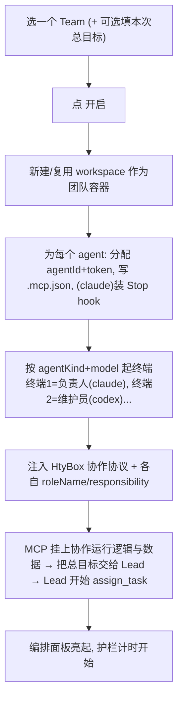
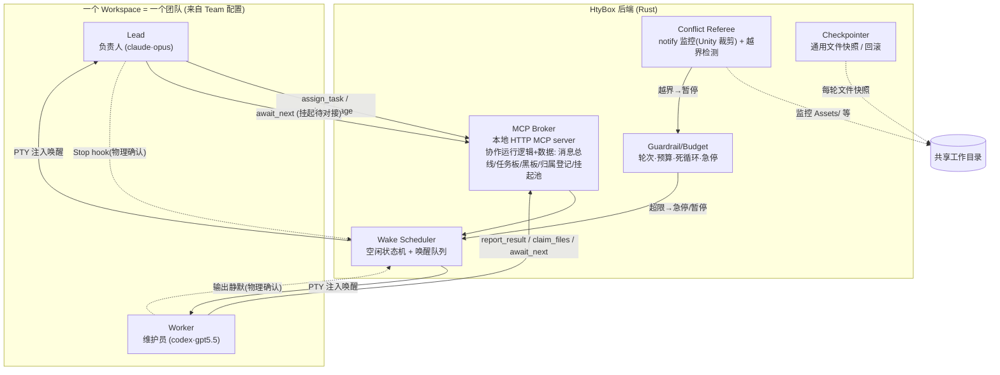

# 08 · 多 Agent 协作设计

> 这是需要**真实设计与验证**的核心能力。本文是我们多轮讨论后的**可施工计划**——multi-agent 关键决策已全部闭合（见 §15），M7 各阶段任务清单见 §14.1；剩余仅实现期需实测项。

---

## 0. 讨论纪要（已锁定的地基）

| 维度 | 选择 | 含义 |
|---|---|---|
| **通信通道** | MCP 中枢 | HtyBox 跑本地 MCP server，agent 用结构化工具协作，不解析 TUI |
| **协作模式** | 主控-工人（Lead 派活） | 一个 Lead agent 拆任务、派给 worker、回收汇总 |
| **自主程度** | 全自动接力（终态） | agent 间自动唤醒接力；**必须配硬护栏**；落地时先半自动验证再开全自动 |
| **文件协作** | 共享目录 + 归属约束 | 同一工作目录，按文件范围划分归属；**配冲突裁判 + 自动检查点** |
| **团队定义** | 可保存的 Team 配置 + 团队库 + 一键开启 | 用户自定义每个 agent 的身份/类型/模型/职责；存库；选库一键开跑（§2） |
| **agent 类型** | 混合 ClaudeCode + Codex | v1 即支持混合团队，**codex 不受限** |
| **空闲检测** | 挂起待对接（`await_next`） | agent **主动**经 MCP 声明"做完、等下一条"为通用主信号；hook/静默仅二次确认（§3、§8） |
| **检查点** | 通用文件快照（无 git） | 用户用 Unity + Plastic SCM、暂不用 git → 文件快照 + Unity 目录裁剪（§10） |
| **角色协议** | HtyBox 应用级协议（非 skill） | 协议随 app 版本管理、与 MCP 强绑定；另设**独立多 Agent 协作界面**一键开启（§5、§13） |

> ⚠️ **关键张力**：全自动 + 共享目录 是冲突风险最高的组合。三道护栏化解：**① Lead 分非重叠文件范围；② 冲突裁判实时监控越界并暂停越界者；③ 每轮自动检查点（文件快照）可回滚**。并采用**自主程度阶梯**：先把通道/唤醒/裁判在半自动下验证通过，再翻开关到全自动（§14）。

---

## 1. 设计目标与边界

**目标**：在一个 workspace 内，多个**可见、可单独检查、可随时人工接管**的 CLI agent 终端，按用户预配的 **Team** 角色分工，在 Lead 指挥下协作完成总目标，且**一键即可开启**。

**为什么不用 Claude Code 自带 subagent / Task**：那些是单进程**内部、不可见、不可单独介入**的；HtyBox 要的是多个**独立进程、各有终端、随时能点进去看/改/接管**的 agent。HtyBox 是它们之间的 **交换机 + 唤醒器 + 看板 + 裁判**。

**边界（v1）**：
- **混合团队、codex 不受限**：claude 与 codex 任意搭配、任意角色。
- 空闲检测**不靠 HtyBox 猜**：靠 agent 主动经 MCP `await_next()` **挂起待对接**（§3、§8），claude+codex 通用。
- 单 workspace 单团队；跨 workspace 团队互不干扰。

---

## 2. Team 配置、团队库与一键开启（⭐ 用户入口）

> 用户真正的操作起点：**先配好"团队"，存进库，之后选任一团队一键开跑**。本节产出的 agent 定义，正是 §6 启动引导消费的输入。

### 2.1 Agent 定义（每个成员四要素 + 编排标记）

用户为每个 agent 配置 **身份(角色名) / agent 类型 / 模型 / 职责内容**，外加一个 **Lead 标记**（编排者，整队恰好一个）。

```ts
interface TeamAgentDef {
  id: string;
  roleName: string;            // 身份/角色名（自定义）：如 "负责人""维护员""计划书写员"
  agentKind: "claude" | "codex";
  model: string;               // 模型；可选范围由 agentKind 决定（2.3）
  responsibility: string;       // 职责内容（自由文本）→ 启动时随协议注入为该 agent 的角色
  isLead: boolean;             // 是否编排者(Lead)；整队恰好一个为 true
  cwd?: string;                // 可选；缺省用所在 workspace 的项目目录
}

interface Team {
  id: string;
  name: string;                // 如 "标准开发三人组""调研双人组"
  description?: string;
  agents: TeamAgentDef[];
}
```

### 2.2 示例团队

你给的 2 人例子：

| 终端 | 角色名(身份) | agent | 模型 | 职责 | Lead |
|---|---|---|---|---|:--:|
| 终端1 | 负责人 | ClaudeCode | opus-4-8 | 主任务需求；拆解、派活、汇总 | ✓ |
| 终端2 | 维护员 | Codex | gpt-5.5 | 探索/维护当前代码现状、回报代码事实 | |

更大的 3 人例子：再加一个 `计划书写员(ClaudeCode·opus)` 负责"书写计划并整合所有需求"。

> "负责人" = **Lead/编排者**（持 `assign_task`、接总目标、做汇总）；其余为带专长的 worker，专长由"职责内容"定义并随协议注入。

### 2.3 模型可选范围由 agent 类型决定（联动下拉）

GUI 里选完类型，模型下拉随之联动。**清单不写死**——配置里维护"每类 agent 的可选模型（可编辑）+ 默认"，理想还能探测 CLI 实际可用模型。

| agent 类型 | 可选模型（示例，运行时以配置/探测为准） | 启动传参（示例，待实测） |
|---|---|---|
| ClaudeCode | `opus-4-8` / `sonnet-4-6` / `haiku-4-5` … | `claude --model <id>` |
| Codex | `gpt-5.5` … | `codex --model <id>`（或其配置文件） |

### 2.4 团队库（持久化 + CRUD + 分享）

存配置（[04 §5](./04-数据模型与注入.md) 的 `tauri-plugin-store`）：`teams: Team[]`。操作：**新建 / 编辑 / 复制 / 删除 / 一键开启 / 导入导出(JSON)**。

### 2.5 一键开启流程



一键开启 = 把静态 `Team` 配置**实例化**为运行中的 workspace 团队。

### 2.6 与 Profile / Workspace 的关系

| 概念 | 回答的问题 | 出处 |
|---|---|---|
| **TerminalProfile** | 怎么起一个终端（shell/cwd/launchCmd/`--model`） | [04 §3](./04-数据模型与注入.md) |
| **TeamAgentDef** | 这个终端在团队里**是谁、用什么模型、干什么、是不是 Lead** | §2.1 |
| **Workspace** | 一组终端/团队的**容器与边界** | [07](./07-工作区管理.md) |

---

## 3. 核心约束:回合制 idle + 挂起待对接

> **CLI Agent 是回合制、空闲即阻塞，没有后台事件循环。** 给它发消息，它空闲时不会主动来收。

三件事必须同时解决：

1. **结构化通道** —— MCP 工具传消息/任务，不解析 TUI。
2. **空闲信号（核心改进）** —— **agent 主动调 MCP 工具 `await_next()`「挂起待对接」**：在一个回合结束前显式声明"我做完了、现在等下一条指令"。这是 claude+codex **通用主信号**，由 agent 自报，比 HtyBox 猜输出可靠得多——也正是 codex 无 hook 时的正解。
3. **唤醒 + 物理确认** —— 挂起的 agent 由"新消息/派活"唤醒（Lead 通知 → HtyBox 经 PTY 注入叫醒）；claude 的 `Stop` hook、codex 的输出静默仅作**物理回合真的结束、可安全注入**的二次确认。`report_result()` 表示"任务语义完成"。

---

## 4. 总体架构



---

## 5. HtyBox 协作协议（应用级，非 skill）

**角色协议是 HtyBox 自带的"应用级协议"，不做成用户 skill、不出现在左栏 skill 列表。** 它随 app 版本统一演进，与 MCP broker 的消息/任务语义强绑定。

协议规定三部分：
1. **角色指令模板**：`Lead 协议` / `Worker 协议` 的系统级说明（怎么用协作工具、回报格式、文件范围纪律、回合纪律）。
2. **数据 schema**：消息 / 任务 / 状态 / 归属登记的结构（broker 与 agent 共识）。
3. **回合纪律**：`做事 → (worker) report_result → await_next() 挂起待对接 → 结束本回合`。

**为什么不做 skill**：协议是 app 运行逻辑的一部分，必须与 broker 实现匹配；做成用户可随意改的 skill 会导致协议与 broker 不一致而崩。高级用户可在设置里覆写模板（可选、有校验）。

**MCP 承载"运行逻辑与数据"**：协议的运行态（谁收到什么、任务到哪步、谁挂起在等）都活在 MCP broker 里，agent 通过工具读写——即你说的"在 MCP 中启用多 agent 协作运行逻辑和数据，用于通知和接收"。

**Lead 编排强度（已定）**：Lead 的拆解/汇总**靠它自身推理**，协议只*引导*不*强制*思考格式——但**结构在工具边界强制**：凡派活必经 `assign_task`（自动上任务板）、凡产出必经 `report_result`。即"结构落在工具契约，而非逼 Lead 按固定 JSON 思考"，既可追踪又不绑死模型灵活性。

---

## 6. Agent 身份与启动引导

agent 成员来自选定的 **Team 配置（§2）**。每个 agent 终端启动时，HtyBox：

1. **注入身份**：环境变量 `HTYBOX_AGENT_ID` / `HTYBOX_WORKSPACE_ID` / `HTYBOX_ROLE`(lead|worker) / `HTYBOX_ROLE_NAME`(如"维护员")。
2. **接入 MCP**：在 cwd 生成 `.mcp.json` 指向 HtyBox 本地 MCP server，带**每 agent 唯一 token**（HTTP header `Authorization: Bearer <token>`）。**Broker 靠 token 识别调用方身份**。
3. **按类型+模型起进程**：`claude --model <id>` / `codex --model <id>`，cwd = 项目目录。
4. **注入协作协议**：把 §5 的 **HtyBox 协作协议** + 该 agent 的 `roleName/responsibility` 作为启动提示注入（**非 skill**）。
5. **装 Stop hook**（仅 claude，作物理确认）：指向 HtyBox 回调端点。

> **MCP 身份机制（已定）**：单 HTTP MCP server + **每 agent 唯一 token**（broker 按 token 认调用方）。理由：进程最少、最简单；claude 原生支持 HTTP MCP + 自定义 header。**待 M7-A 验证 codex 是否支持 HTTP+header**——若某 agentKind 的 CLI 只支持 stdio MCP，则该类 agent 退化为"每 agent 一个 stdio shim 转发同一中央总线"（仅传输层不同，broker/数据不变）。

---

## 7. MCP 工具清单（协作协议的工具面）

| 工具 | 谁用 | 作用 |
|---|---|---|
| `whoami()` | 全部 | 返回 {agentId, role, roleName, workspace, assignedScope} |
| `list_agents()` | 全部 | 花名册 + 各自状态 + 角色 |
| `send_message(to, content, type?)` | 全部 | 投递到目标信箱，触发唤醒 |
| `broadcast(content)` | Lead | 群发 |
| `read_inbox()` | 全部 | 取走我的未读消息 |
| `assign_task(workerId, task, fileScope)` | Lead | 建任务、指派、定文件范围、唤醒 worker |
| `report_result(taskId, summary, artifacts)` | Worker | 回报结果（标记完成、唤醒 Lead）——**语义完成** |
| **`await_next(note?)`** | **全部** | **挂起待对接**：声明本回合做完、进入等待池；broker 据此置 idle，有新消息时唤醒。**通用空闲主信号** |
| `claim_files(paths)` / `release_files(paths)` | Worker | 归属登记（与裁判联动；重叠则排队） |
| `update_status(state, note?)` | 全部 | 主动报状态（如"卡住、需澄清"） |
| `read_shared(key)` / `write_shared(key, val)` | 全部 | 共享黑板（总目标、约定、公共结论） |

---

## 8. 唤醒调度与状态机（挂起待对接为主）

```
        assign/message 入队
 idle ──────────────────────► pending(有活待处理)
  ▲                               │ 注入唤醒(仅当物理回合已结束)
  │ await_next() 挂起 + 物理确认     ▼
  └────────────  working  ◄───────┘
                   │ 物理 stop 了却没 await_next/report
                   ▼
                 waiting(卡住, 需人工/升级)
```

- **空闲主信号 = `await_next()`**：agent 显式声明挂起。broker 立即知道它进入等待池。
- **物理确认**：claude=`Stop` hook，codex=输出静默 —— 确认回合真的结束、注入安全。**先有 `await_next` 语义意图，再有物理确认，才注入下一条**，避免中途注入撕裂 TUI。
- **`await_next` 实现（已定）**：默认 **(a) 非阻塞 + PTY 唤醒** —— 工具立即返回"已挂起，请结束本回合"；agent 停在提示符；有消息时 HtyBox 注入唤醒。健壮、无工具超时风险、每次处理是干净的新回合、可被用户中途接管。**(b) 阻塞长轮询**（工具挂住直到有消息）留作可选优化：对 codex 更干净（免输出静默），M7-B 评估是否对 codex 启用；但要扛 CLI 工具超时与单回合上下文增长，故不作默认。
- **唤醒触发方**：通常是 **Lead（claude）** 发消息/派活（"等待 claudecode 通知"）；HtyBox 把消息经 PTY 注入叫醒挂起的 agent。
- **卡住兜底**：物理 stop 了但没 `await_next`/`report_result`（提问/报错/跑偏）→ 判 `waiting` → 升级：通知 Lead / 通知用户 / 重试。

---

## 9. 编排流程（主控-工人，目标态全自动）

```mermaid
sequenceDiagram
    participant U as 你
    participant L as 负责人(Lead·claude)
    participant H as HtyBox
    participant M as 维护员(codex)

    U->>L: 一键开启时把总目标交给 Lead
    L->>H: assign_task(维护员, 探索现状, scope=只读)
    L->>H: await_next() 挂起, 等回报
    H->>M: 唤醒
    M-->>H: report_result(现状摘要)
    M->>H: await_next() 挂起
    H->>L: 唤醒("维护员已回报")
    L->>U: 汇总; 如需→再派下一批 / 否则产出结果
```

- **并行派发**：Lead 可同时给多 worker 派活（不重叠 scope），最大化多终端价值；重叠经 `claim_files` 串行化。
- **范围分区**：Lead 分配**互不重叠的文件范围**是并发安全的第一道保障。

---

## 10. 文件协作与冲突防护（共享目录 + 归属约束，无 git）

软约束不足以拦住 LLM 越界，三道护栏：

1. **范围分区（设计期）**：`assign_task` 给每个 worker 明确 `fileScope`（只准改这些路径），写进协议与唤醒提示。
2. **冲突裁判（运行期硬检测）**：`notify` 监控工作目录，对照归属登记。检测到 agent 改了不属于它的文件 → 记冲突 → **暂停越界者** → 通知 Lead/用户裁决。
3. **自动检查点（文件快照，可恢复）**：
   - **用户用 Unity + Plastic SCM、暂不用 git → 默认通用文件快照**：把"纳入范围"的文件复制到 HtyBox 快照区（带时间戳/轮次号），踩踏可回滚到上一干净点。
   - **Unity 裁剪（监控 + 快照都适用）**：只针对 `Assets/`、`ProjectSettings/`、`Packages/manifest.json` 等源文件；**排除 `Library/`、`Temp/`、`obj/`、`Logs/`、`Build*/`**（否则又大又无意义）。
   - **检查点后端可插拔**：文件快照（默认）/ 未来可接 git / Plastic `cm shelve`（类 stash、不污染历史）。

---

## 11. 护栏与急停（全自动的前提）

| 护栏 | 说明 |
|---|---|
| **最大轮次/唤醒数** | 每 agent、每次运行的硬上限，触顶自动暂停 |
| **并行 worker 数（已定）** | 默认**同时 working 的 worker ≤ 4**（可配；团队成员可更多，超出则排队）；新建团队成员过多时按"你的 Claude/Codex 速率限额"给软提示。平衡并行收益 vs 资源/限额/冲突面 |
| **预算/成本（已定）** | 护栏主指标用**始终可得的代理量：唤醒/回合数 + 时长 + 工具调用数**，触顶暂停（目标是防失控，非精确计费）；若 CLI 能暴露真实 token 用量则叠加显示 |
| **死循环检测** | A↔B 消息往复重复 / 反复唤醒却无产出（消息哈希 + 无进展计数）→ 暂停 |
| **一键急停** | 全局 STOP：停所有唤醒注入，可选向所有 agent 发中断(Ctrl+C)，冻结现场 |
| **单 agent 暂停/接管** | 任意终端点进去暂停、手动接管，再交还自动流 |

---

## 12. 失败与边界场景

| 场景 | 处理 |
|---|---|
| 物理 stop 了但没 await_next/report | 判 `waiting`，升级给 Lead/用户，可重试 |
| agent 进程崩溃/退出 | **自动替补**：重启同角色终端 + 复职简报从 broker 恢复在办任务（详见 §12.5）|
| MCP 断连 | agent 失协作能力 → 暂停团队、提示重连 |
| 越界改文件 | 裁判暂停越界者 + 回滚文件快照 + 人工裁决 |
| 预算/轮次触顶 | 自动暂停，等用户决定续跑/收尾 |
| 全员互等（死锁） | 检测"无人 working 且都在挂起/等锁" → 暂停 + 报告 |
| `await_next` 长轮询超时(实现b) | 工具返回"无消息"，agent 重新挂起；或降级到实现(a) |
| 用户中途接管某 agent | 转人工态，对它的自动唤醒暂停，操作完可交还 |

---

## 12.5 · Agent 崩溃自愈与替补（自动顶岗）

> 需求：agent 可能崩溃或被误关；一旦发生，HtyBox 要**自动重启一个替补 agent 终端、立刻补上岗位空缺**，且尽量不丢工作进度。这条与"信息不丢失 / 高效率"原则同向。

### 检测（多信号，进程退出为准）
- **PTY 子进程退出**（reader EOF）：最直接即时的"终端没了"信号。
- **MCP 断连** / **心跳超时**：辅助信号。
- 进程退出 = 需要替补的硬判定；**仅 MCP 闪断但进程还活 → 只重连、不重启**。

### 分类（决定要不要替补）
| 情况 | 处理 |
|---|---|
| HtyBox 主动结束（团队完成 / 用户停团队） | 不替补 |
| 异常崩溃（非正常退出 / 信号） | **自动替补** |
| 用户手动关闭运行中团队的成员 | 默认**自动替补**（应对"误关"），同时弹**可撤销倒计时**"正在替补 维护员…（撤销）"，不与有意关闭对抗 |

### 替补流程（顶岗）
1. 检测到死亡 → 花名册/仪表盘标 `down`，暂停对它的唤醒，**冻结其在办任务**（不丢、不重复派）。
2. **重启**同一 `TeamAgentDef`（同角色/类型/模型/cwd/isLead）的新终端。
3. 重新引导：新 token、新 `.mcp.json`、（claude）重装 Stop hook、重注入 **HtyBox 协作协议 + 角色/职责**。
4. **复职简报（关键）**：从 broker 的持久协作数据重建一份简报，注入新终端第一回合 —— 角色+职责、总目标(黑板)、在办任务+文件范围(任务板)、已回报产出(避免重做)、近期相关消息(信箱/日志)、当前文件状态(最近检查点)，并下指令"从这里继续 / 必要时重做当前任务"。
5. 重新入册，恢复调度（补发排队消息、为在办任务重新唤醒）。
6. 仪表盘记"替补事件"，通知 Lead："维护员 已重启顶岗，继续 t1"。

### 为什么能恢复：broker 是"活在 agent 之外"的记忆
替补 agent 拿不到崩溃者的完整对话/推理，只能拿 broker 持久化的产物。**恢复质量 = agent 平时把多少状态外化到 broker**。所以协议强制勤外化（进展写黑板、阶段性 report_result、改文件前 claim+checkpoint），让任意单点崩溃只损失最后一小步 —— 这正是"信息不丢失"的落地。

### 边界
- **Lead 崩溃**：最高优先替补；从黑板/任务板恢复"已派/在办/待派"，替补 Lead 续接编排；替补期间可暂停 worker。
- **崩溃循环**：同岗位短时间重启 ≥N 次（默认 3）→ 停止自动替补、升级给用户（防无限重生）。
- **半截改动**：检查点 + 裁判保证文件状态可知；替补认领同范围，必要时先回滚到上一干净点再续。
- **任务记账**：在办任务回到 in-progress 给替补；report_result 容忍重复（幂等/合并）。

### 配置
每团队/每 agent 的"自动替补"开关（运行中默认开）· 最大替补次数（默认 3）后升级 · 复职简报详略可配。

---

## 13. UI 设计

### 13.1 独立的多 Agent 协作界面（专门入口）⭐

一个**专门的视图/入口**（如主界面顶部"多 Agent 协作"按钮/模式），内含三个子标签 **团队库 / 运行面板 / MCP 仪表盘**，承载：团队库 → 一键开启 → 运行编排 → 基础设施诊断。一键 = **角色映射到终端**并自动起好、注入协议、在 MCP 挂上协作运行逻辑与数据：

```
点"标准开发三人组"的 ▶ 一键开启
  → 终端1 = 负责人  = ClaudeCode·opus   (Lead)
  → 终端2 = 维护员  = Codex·gpt5.5
  → 终端3 = 计划书写员 = ClaudeCode·opus
  → MCP broker 挂上消息/任务/挂起池, Lead 拿到总目标开跑
```

### 13.2 团队配置 GUI

**团队库视图**：

```
┌─ 团队库 ───────────────────────────────────────[ + 新建团队 ]┐
│ ┌───────────────────────────┐  ┌───────────────────────────┐ │
│ │ 标准开发三人组             │  │ 调研双人组                 │ │
│ │ 👑负责人(claude·opus)      │  │ 👑负责人(claude·opus)      │ │
│ │ 🔧维护员(codex·gpt5.5)     │  │ 🔍维护员(codex·gpt5.5)     │ │
│ │ 📝计划书写员(claude·opus)  │  │                           │ │
│ │ [▶ 一键开启][编辑][复制][×]│  │ [▶ 一键开启][编辑][复制][×]│ │
│ └───────────────────────────┘  └───────────────────────────┘ │
└──────────────────────────────────────────[ 导入 ][ 导出 ]────┘
```

**Team 编辑器**（每成员四要素 + Lead 单选；类型变→模型联动）：

```
┌─ 编辑团队：标准开发三人组 ───────────────────────────────────┐
│ 团队名 [标准开发三人组            ]  描述 [............]      │
│ ┌─ 成员 1 ────────────────────────────────────  (Lead) ◉ ─┐ │
│ │ 角色名 [负责人          ]  类型 [ClaudeCode ▾] 模型[opus-4-8 ▾]│
│ │ 职责   [主任务需求；拆解任务、派活、汇总结果        ]      │ │
│ └──────────────────────────────────────────────────[删除]─┘ │
│ ┌─ 成员 2 ────────────────────────────────────  (Lead) ○ ─┐ │
│ │ 角色名 [维护员          ]  类型 [Codex      ▾] 模型[gpt-5.5 ▾]│
│ │ 职责   [探索/维护当前代码现状、回报代码事实         ]      │ │
│ └──────────────────────────────────────────────────[删除]─┘ │
│ [ + 添加成员 ]                              [取消]  [保存]   │
└──────────────────────────────────────────────────────────────┘
```

### 13.3 运行时编排面板

- **花名册**：每 agent 一行 —— 角色名、类型·模型、状态(idle/working/waiting/error)、当前任务、文件范围。
- **任务板**：任务列表（指派人/状态/范围）。
- **消息日志**：谁对谁说了什么（时间线）。
- **护栏仪表**：已用轮次/预算、运行时长。
- **大红 STOP 急停** + 每行 暂停/接管。
- **可视化派发**：Lead→worker 派活连线。
- 点 agent 行 → 跳到/高亮其终端，随时介入。

---

### 13.4 MCP 服务器仪表盘（决策已定）

多 Agent 协作界面的子标签之一（与 团队库、运行面板 并列）。**基础设施/诊断视图**，区别于运行面板的工作视图。以下取舍按"交互顺畅 / 信息不丢失 / 高效率"定稿：

- **服务器卡 + 健康/自愈卡**：Running/端口/传输/uptime；健康卡含**告警数 + 崩溃替补次数**。服务器**自托管**（随团队自动起、失败自重启），只给紧凑控制（↻/⋯：停止/重启/日志/复制端点）——不让用户为它操心（决策 4）。
- **Agent 对接情况表**：每 agent 的 token、连接、能力协商、**Stop hook 是否已装**（codex 显式标"无 hook"）、心跳、调用数 —— 一眼看出"谁没对接上"。
- **工具调用·统一实时流**：所有 agent 的工具调用按**单一时间线**呈现，保留跨 agent 因果（A 派活→B 回报→唤醒 C）；配筛选 `全部 / 仅错误 / 按 agent`，自动滚动、悬停暂停（决策 2：统一流不分裂，再加筛选，兼顾"不丢信息"与效率）。
- **任务板 + 协作数据**：消息总线/信箱、黑板、文件归属登记、挂起池/唤醒队列。
- **崩溃可见**：agent 崩溃→替补时，顶部出"替补中"醒目卡 + 流里 `process exit / respawn / inject 复职简报 / resumed` 事件（见 §12.5；mockup：[`svg/mcp-dashboard-recovery.svg`](svg/mcp-dashboard-recovery.svg)）。
- **入口（决策 3）**：仪表盘是协作界面下的**子标签**，不做顶层入口——只在协作时才相关，保持主工作区清爽。

---

## 14. 里程碑（自主程度阶梯 —— 先验证后放开）

> 在主线 [05](./05-里程碑与任务拆解.md) 的 M4 之后展开为 M7。每阶段独立验证，护栏就绪前不开全自动。

| 阶段 | 目标 | 验收 |
|---|---|---|
| **M7-A 通道** | MCP Broker + 身份(token) + `send_message`/`read_inbox` | 2 个 claude **手动**互发消息收到，Broker 正确识别身份 |
| **M7-B 挂起/唤醒** | `await_next()` 挂起待对接 + Wake Scheduler 状态机（**半自动**：到达提示你、点一下才唤醒）；实测 await_next 用 (a)非阻塞还是 (b)长轮询；codex 验证 | 给挂起 agent 投消息→提示→点击→被唤醒并处理；working 中消息正确排队；**codex 经 await_next 正常挂起/唤醒** |
| **M7-G 团队配置** | Team 数据模型 + 团队库(CRUD/导入导出) + **一键开启**逻辑 + 独立协作界面/配置 GUI | GUI 配出团队保存；一键开启按类型/模型起终端、注入协议、MCP 挂上协作数据（**数据模型+开启逻辑是 M7-C 前置；GUI 可与 C/D/F 并行**） |
| **M7-C 编排协议** | §5 应用级协议落地 + `assign_task`/`report_result` + 任务板（仍半自动唤醒） | Lead 派 1 子任务→确认唤醒 worker→worker report→Lead 收到汇总 |
| **M7-D 全自动+护栏** | 打开自动唤醒接力；轮次/预算/死循环/急停齐备 | 端到端无人工接力跑通混合团队目标；护栏正确暂停；STOP 立即生效 |
| **M7-E 文件安全** | 冲突裁判 + 文件快照检查点（Unity 裁剪） | 故意越界→被暂停+可回滚；并行不重叠范围互不干扰 |
| **M7-F 编排 UI + MCP 仪表盘** | 花名册/任务板/日志/仪表/急停 + 子标签仪表盘(对接情况/统一工具流/协作数据) + 协作界面打磨 | 一次团队运行全程可观测、可介入；仪表盘能看 MCP 健康与各 agent 对接 |
| **M7-H 崩溃自愈** | 进程退出/断连/心跳检测 + 自动重启同角色终端 + 复职简报恢复 + 崩溃循环熔断 | 杀掉一个 worker 进程 → 自动起替补、注入复职简报、续做在办任务；连杀 3 次触发熔断升级；误关有可撤销提示 |

> 建议 M7-A/B 跑通后写一条 memory，记录"Claude Code/Codex 接 HtyBox MCP + `await_next` 挂起/唤醒 + Stop hook 回调"的可用配置与坑。

---

### 14.1 M7 各阶段任务清单（可施工）

**M7-A 通道（MCP Broker + 身份）**
- [ ] Rust 内嵌本地 HTTP MCP server（broker），随 app 起；端口分配 + 健康检查
- [ ] 最小工具集：`whoami` / `list_agents` / `send_message` / `read_inbox`
- [ ] 每 agent 生成唯一 token + 写 `.mcp.json`（`Authorization` header）；broker 按 token 认身份
- [ ] 起 2 个 claude 终端、注入 `.mcp.json`，各自 `whoami` 出正确身份
- [ ] **验证 codex** 能否连 HTTP MCP + header；不行则实现 stdio shim 退化路径
- [ ] 手动 `send_message`/`read_inbox` 互通

**M7-B 挂起/唤醒（状态机，半自动）**
- [ ] `await_next`（非阻塞）+ broker 等待池
- [ ] Stop hook 安装 + 回调端点（claude）；codex 输出静默检测器
- [ ] Wake Scheduler 状态机：idle/pending/working/waiting；working 时消息排队
- [ ] 半自动唤醒 UI：有消息提示 → 用户点击 → PTY 注入唤醒
- [ ] 卡住检测（物理 stop 却无 `await_next` → waiting）
- [ ] （评估）codex 的 (b) 长轮询变体

**M7-G 团队配置（数据 + 一键开启 + GUI）**
- [ ] `Team` / `TeamAgentDef` 数据模型 + 团队库持久化（`tauri-plugin-store`）
- [ ] 团队库 CRUD + 导入导出 JSON
- [ ] Team 编辑器 GUI（四要素 + 类型→模型联动 + Lead 单选校验）
- [ ] 一键开启：实例化为 workspace、按类型+模型起终端、注入协议、挂 MCP
- [ ] 模型清单：默认 + 设置可维护 +（尽量）探测 CLI

**M7-C 编排协议（应用级协议落地）**
- [ ] HtyBox 协作协议模板（Lead/Worker 系统指令、回报格式、回合纪律）
- [ ] 工具：`assign_task` / `report_result` + 任务板数据
- [ ] 黑板 `read_shared`/`write_shared`；总目标交付 Lead
- [ ] 半自动跑通：Lead 派 1 活 → worker report → Lead 汇总

**M7-D 全自动 + 护栏**
- [ ] 自动唤醒接力（去掉人工点击）
- [ ] 护栏：最大轮次/唤醒、并行 ≤ 4、回合+时长+调用数预算、死循环检测
- [ ] 一键急停（停注入 + 可选 Ctrl+C）+ 单 agent 暂停/接管
- [ ] 端到端混合团队（claude+codex）无人工接力跑通

**M7-E 文件安全**
- [ ] `claim_files`/`release_files` 归属登记 + 重叠串行化
- [ ] 冲突裁判：`notify` 监控（Unity 裁剪）+ 越界暂停
- [ ] 文件快照检查点（Unity 目录裁剪）+ 回滚；后端可插拔接口
- [ ] 验证：故意越界被拦+回滚；并行不重叠互不干扰

**M7-F 编排 UI + MCP 仪表盘**
- [ ] 运行面板：花名册/任务板/消息日志/护栏仪表/STOP/接管
- [ ] MCP 仪表盘子标签：服务器卡+健康/自愈卡、对接情况表、统一工具流+筛选、协作数据
- [ ] 可视化派发连线；点 agent 跳转终端

**M7-H 崩溃自愈**
- [ ] 死亡检测：PTY 进程退出（主）+ MCP 断连 + 心跳超时
- [ ] 分类：主动结束 / 崩溃 / 手动关闭（误关→可撤销倒计时）
- [ ] 替补：重启同 `TeamAgentDef` + 重发 token/`.mcp.json`/hook/协议
- [ ] 复职简报：从 broker（任务板/黑板/归属/检查点/已回报）重建并注入
- [ ] 崩溃循环熔断（默认 3 次）+ Lead 崩溃优先替补
- [ ] 验证：杀 worker→自动顶岗续做；连杀 3 次熔断

> **依赖**：A→B→C→D→E→F 主链；G 的数据/开启逻辑是 C 的前置（GUI 可与 C/D/F 并行）；H 依赖 A/B（检测+重启+复职）。

---

## 15. 决策记录（全部已闭合）

**✅ 本轮已定（2026-06-23）**：
- 空闲检测 = `await_next()` 挂起待对接（主，claude+codex 通用）+ hook/静默（二次确认）；**codex 不受限**。
- 检查点 = **通用文件快照**（Unity 目录裁剪），暂不用 git；后端可插拔（未来可接 git/Plastic `cm shelve`）。
- 角色协议 = **HtyBox 应用级协议，非 skill**；提供**独立多 Agent 协作界面**一键开启；MCP 承载协作运行逻辑与数据。
- **Agent 崩溃自愈**（你来决策）= 异常崩溃/误关 → **自动重启同角色终端替补顶岗** + 从 broker 重建**复职简报**恢复在办任务；误关给可撤销倒计时；崩溃循环熔断（默认 3 次后升级）。见 §12.5。
- **MCP 仪表盘取舍**（你来决策）= 协作界面下的**子标签**（非顶层入口）；工具调用**统一时间线 + 筛选（按 agent/工具/仅错误）**；服务器**自托管 + 紧凑控制**；健康卡含"替补次数"。见 §13.4。

**✅ 续议已定（2026-06-23，授权我决策）**：
- **MCP 身份机制** = 单 HTTP server + 每 agent token（最少进程、最简单）；codex 若不支持 HTTP+header，则该类 agent 退化为 stdio shim 转发同一总线（M7-A 验证 codex）。见 §6。
- **`await_next` 实现** = 默认 (a) 非阻塞 + PTY 唤醒（健壮、可中途接管）；(b) 长轮询留作 codex 可选优化，M7-B 评估。见 §8。
- **并行 worker 数** = 默认同时 working ≤ 4（可配），超出排队；成员过多给速率限额软提示。见 §11。
- **预算/成本** = 护栏主指标用始终可得的"回合数 + 时长 + 工具调用数"代理量；真实 token 可得则叠加显示。见 §11。
- **模型清单来源** = 可维护列表 + 合理默认 + 尽量探测 CLI。见 §2.3。
- **Lead 编排强度** = Lead 自主推理 + 结构在工具边界强制（assign_task/report_result），不逼固定 JSON。见 §5。

**本文状态**：multi-agent 关键决策已**全部闭合** → **可施工计划**。M7 各阶段任务清单见 §14.1；剩余仅实现期需实测项（已在各小节标注"待 M7-x 验证"）。
